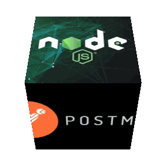
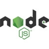

# Бэкенд для проекта Mesto

    
## Описание:
Проэктная работа создана с целью закрепить познания в Express.js на практике. Сервер предоставляет статику сайта, а также отвечает на Get запросы.
Обратиться к серверу можно ` http://178.154.233.114:3000/users ` или  ` www.pavlov.students.nomoreparties.xyz  `

## Функционал: 
### GET запросы:
- Запрос на `localhost:3000/users` вернет список всех пользователей из базы **mestodb**
- Запрос на `localhost:3000/cards` вернет список всех карточек всех пользователей из базы **mestodb**
- Запрос на `localhost:3000/cards/:userId` вернет конкретного пользователя с переданным после **/users** идентификатором

### POST запросы:
- Создание пользователя
Запрос на `localhost:3000/users`
В теле POST-запроса на создание пользователя необходимо передать **JSON**-объект с тремя полями:
```sh
{
    "name": "Имя пользователя",
    "about": "Описание",
    "avatar": "Ссылка на аватар пользователя"
}
```
- Создание карточки
Запрос на `localhost:3000/cards`
В теле POST-запроса на создание карточки необходимо передать **JSON**-объект с двумя полями:
```sh
{
    "name": "Место",
    "link": "Ссылка на фотографию места",
}
```
### DELETE запросы:
- Удаление карточки по её id
Запрос на `localhost:3000/cards/:cardId` удаляет карточку с переданным после **/cards** идентификатором


Как установить проект?
================
## Для начала работы вам необходим:

- <a href="https://nodejs.org/en/">NodeJS & npm<a> - среда выполенния кода JavaScript вне браузера. Позволяет писать серверный код для динамических веб-страниц и веб-приложений.
- <a href="https://gitforwindows.org/">Git Bash<a> если вы используете Windows OS.

## Установка

### Склонировать проект на ПК:

    git clone https://github.com/pavelcydep/servis-mesto-api.git


### Установить зависимости

    npm install


## Технологии:




